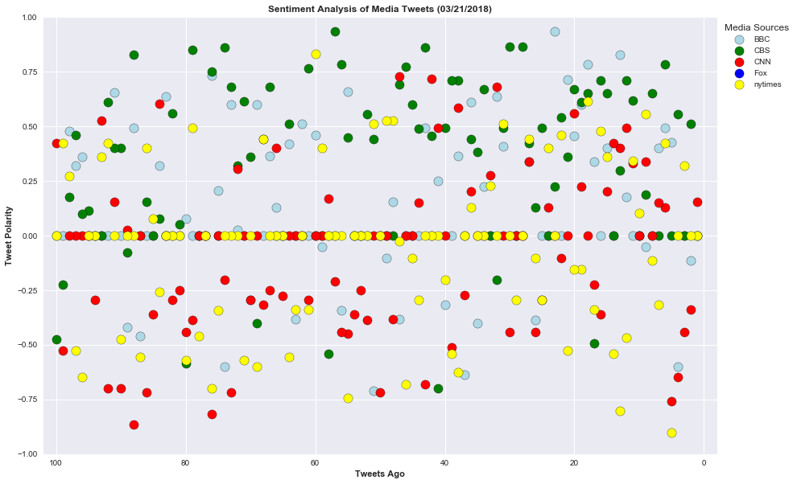
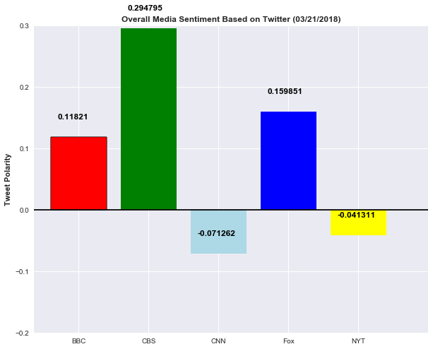

```python
#import dependencies
import pandas as pd
import numpy as np
import seaborn as sns
import matplotlib.pyplot as plt
import json
import time
import tweepy
from config import consumer_key, consumer_secret, access_token, access_token_secret
from vaderSentiment.vaderSentiment import SentimentIntensityAnalyzer
analyzer = SentimentIntensityAnalyzer()
```


```python
# Set up Tweepy API Authentication
auth = tweepy.OAuthHandler(consumer_key, consumer_secret)
auth.set_access_token(access_token, access_token_secret)
api = tweepy.API(auth, parser=tweepy.parsers.JSONParser())
```


```python
#Target Media search term
news_outline = ["@BBC", "@CBS", "CNN", "FOX", "@nytimes"]
counter = 1
sentiments =[]
```


```python
for outline in news_outline:
    public_tweets = api.user_timeline(outline, count=100)
    tweetnumber = 1       
    for tweet in public_tweets:
        print("Tweet %s: %s" % (counter, tweet["text"]))
        compound = analyzer.polarity_scores(tweet["text"])["compound"]
        pos = analyzer.polarity_scores(tweet["text"])["pos"]
        neu = analyzer.polarity_scores(tweet["text"])["neu"]
        neg = analyzer.polarity_scores(tweet["text"])["neg"]
        tweets_ago = tweetnumber
        sentiments.append({"Media Source": outline,
                           "Text":tweet["text"],
                           "Date": tweet["created_at"],
                           "Compound": compound,
                           "Positive": pos,
                           "Neutral": neu,
                           "Negative": neg,
                           "Tweet Count": tweetnumber})
        tweetnumber +=1
        counter +=1
```

    Tweet 1: RT @BBCSport: John Bishop’s on a one man mission to World Cup victory for @SportRelief!
    
    Keep an eye out here for Geoff Hurst's 'dab' 😳🤣🙌…
    Tweet 2: "I felt vulnerable but now I feel empowered.”
    
    25-year-old rapper Paigey Cakey had a hair transplant after her hair… https://t.co/fGoueTbzyQ
    Tweet 3: Watch as @ZoeTheBall attempts to cycle over 300 miles, to raise awareness about mental health and raise money for… https://t.co/qGcCT8wLSt
    Tweet 4: Who were my parents - and why was I left on a hillside to die? 
    
    After a life full of questions, Anthea finally has… https://t.co/5fEma0vgfw
    Tweet 5: 😍🍫You really can't go wrong with a recipe from Mary Berry. 
    
    ❤️️🍰 Here are some of @BBCFood's favourites. 👉… https://t.co/svyK73KV0o
    Tweet 6: Is it too late to save the oceans from plastic? 🦈
    
    Go behind the scenes of the documentary Sir David Attenborough c… https://t.co/SjXbB6OZAN
    Tweet 7: RT @bbcmusic: Anne-Marie, Kylie Minogue, Ladysmith Black Mambazo and more have been added to the lineup for The Queen's Birthday Party conc…
    Tweet 8: Fictional locations such as Narnia, Gotham City and Neverland have mysteriously appeared on road signs in Oxfordshi… https://t.co/3NzQqfNNux
    Tweet 9: 🎶 Did you know that @DBtodomundo was asked to leave his school choir? 
    
    📻 Here are 11 things we learned from the Ta… https://t.co/tusEZQgIbG
    Tweet 10: What did students think when the BBC transported them to places they never thought possible? #ForReal… https://t.co/KFgZaE3PXi
    Tweet 11: Almost 1,000 sausage dogs have taken part in a dachshund dash! 🐶❤️️🐾
    
    https://t.co/SMYaziJUrq
    Tweet 12: Ruben is a star of @cbbc's #TheDumpingGround and has Down's Syndrome.
    
    Growing up with a disability could have been… https://t.co/lNo1Pa2wTu
    Tweet 13: The annual Marmalade Festival held at the weekend is one of the UK's many festivals dedicated solely to a particula… https://t.co/I75Ufx17Gq
    Tweet 14: Spring has officially sprung! 🌺🌷🌸🌱🌻
    
    https://t.co/fAZSeVV8Oo
    Tweet 15: "I've just had a haircut so I now look ninety-nine-and-a-half!" 💁🎉❤️️
    
    A 100-year-old called Sadie has shared the s… https://t.co/X9QbWw0Ey0
    Tweet 16: RT @BBC_Teach: On #WorldPoetryDay let us know which your class’ favourite poem and/or poet?
    
    Is it one of these? 👇👉 https://t.co/qtn7IPXDFH…
    Tweet 17: RT @bbcthree: This inspirational teacher overcame his stammer and is now showing his students how to do the same. https://t.co/JMAWR0conA
    Tweet 18: RT @bbcthree: This Country winning their 3rd award 🏆🏆🏆 #RTSAwards https://t.co/oBdg1KruHK
    Tweet 19: RT @bbcpress: Four new dramas announced for @BBCOne from writers Marnie Dickens (#Thirteen), Levi David Addai (#Damilola, Our Loved Boy), B…
    Tweet 20: RT @BBCOne: #EastEnders is back on Thursday with a special double bill at 7.30pm and 9pm on @BBCOne! And you know what that means… https://…
    Tweet 21: ⛈🌤😂 @AlanCarr responds to those weather forecasters that LOVE a bit of drama. 
    https://t.co/T9gpTdqDt3
    Tweet 22: 🌻🌻🌻 Did you know that the head of a sunflower is built of up to 2000 flowers? 
    
    📻👉 https://t.co/aIWLu7AQES https://t.co/gNmcaG1ri5
    Tweet 23: Wow! 19-year-old Justice Osei from Ghana has an amazing talent for imitating animals. 🐊🐢🐒🦇🐇🐿🐓🐑🐸🦆🦎
    https://t.co/UZqeSyzsQB
    Tweet 24: This #WorldFrogDay, why not try making an origami jumping frog with @BBCTaster's step-by-step tutorial? 🐸… https://t.co/jjMqUND883
    Tweet 25: Michael Portillo travels across India guided by Bradshaw's 1913 Handbook of Indian, Foreign and Colonial Travel. 🇮🇳… https://t.co/4WG0esDk8m
    Tweet 26: Can you watch this without laughing? 😹🔊 You'll want your sound on for this! #InternationalDayOfHappiness
    
    https://t.co/vA5yr0PCC5
    Tweet 27: Professor Stephen Hawking's funeral will take place in Cambridge - "the city that he loved so much and which loved… https://t.co/LHh0Nfeh6U
    Tweet 28: Un-bee-lievable! 🐝😍 Meet the woman who kept a bee as a pet. 
    https://t.co/5zRxWpSGOH
    Tweet 29: Arise, Sir Ringo! 🎖🎶@thebeatles drummer @ringostarrmusic has been knighted for his services to music.… https://t.co/OQLixgO2Zi
    Tweet 30: The first polar bear cub to be born in the UK for 25 years has emerged from his den at Scotland's Highland Wildlife… https://t.co/WZLoy2mz7y
    Tweet 31: 'Everybody has a voice'. ❤️️🎶
    
    Rugby legends JPR Williams and JJ Williams visit @FMNChorus and the BBC National Cho… https://t.co/myuIpumZnL
    Tweet 32: 📸The best pictures from the 2018 Paralympic Winter Games in Pyeongchang: https://t.co/w8dYDPHkAw https://t.co/0SVnupv9rB
    Tweet 33: Prince Harry and Meghan Markle have chosen an organic lemon and elderflower cake for their wedding in May. 🍰🍋💍… https://t.co/H7dWlxmYcR
    Tweet 34: RT @BBCWalesNews: 🎟🎞🍿Cinema makes maths class an offer they can't refuse
    Full story: https://t.co/Uwg6NTRFVF https://t.co/hr4dglHIu3
    Tweet 35: People always have an opinion. 🙄😂 Here's why @AlanCarr doesn't trust TripAdvisor reviews. #LiveAtTheApollo 
    
    https://t.co/PvF6K9hYMI
    Tweet 36: From a spot of spring cleaning to rolling cheese down a hill... 🕸🧀🌱
    
    Here are nine ways to celebrate spring!… https://t.co/ujBmBsHast
    Tweet 37: Sudan, the world's last surviving male northern white rhino has died after months of ill health. 💔🦏… https://t.co/BnYne3cI2L
    Tweet 38: This #InternationalDayOfHappiness, let's all try to be a little more like @chessmartinez. 😊👏#LiveAtTheApollo 
    
    https://t.co/VddL8zWJfS
    Tweet 39: RT @BBCOne: They've finally quacked the case.
    
    https://t.co/eq4dLcauhe
    Tweet 40: RT @BBCEarth: Sudan’s death leaves just two females of the subspecies alive in the world 
    https://t.co/kCpRCxFaFY
    Tweet 41: RT @bbcthree: RuPaul is the first drag queen to get a Hollywood star. Sissy that Walk of Fame.  https://t.co/SmqOPQizh3 https://t.co/hWb1Xm…
    Tweet 42: RT @BBCBreakfast: ❄️❄️BBRRR....Could it be the coldest day yet for the Spring Equinox?
    Let us know what temp it is where you are today.  #S…
    Tweet 43: Meet Bumblebee and Gnat, two adorable badger cubs being raised at an animal sanctuary. 😍
    https://t.co/Ihami0VtL0
    Tweet 44: Spring is here! But what is the #SpringEquinox? 🌺🌻🌸🌱https://t.co/RiWP3PC7Yo https://t.co/FIKocYFP6C
    Tweet 45: Five times Beyonce and Jay-Z’s daughter Blue Ivy outshone her parents. ⭐️ https://t.co/JaNAzsofOm https://t.co/DnoyApY0yL
    Tweet 46: Traditional Highland Games sports such as tossing the caber and tug-of-war are to be taught in PE lessons. 🏆… https://t.co/jv5wlpmlyT
    Tweet 47: Follow the dramatic and deadly series of events that took place at two funerals in Belfast in March 1988. 
    
    The Fun… https://t.co/y3MZaR8hsi
    Tweet 48: Leonardo DiCaprio stars in the true story of a con man who cashed fake cheques worth millions. 
    
    Catch Me If You Ca… https://t.co/HWShPj9ngi
    Tweet 49: 😂📸 @AlanCarr learned the hard way that you only get one shot at a school photo. #LiveAtTheApollo 
    
    https://t.co/fv5JmcRgz4
    Tweet 50: 🎤Pop band @FifthHarmony have announced they're taking a break to pursue solo careers 🎶https://t.co/tLOR7h1gZy https://t.co/5c77Cfjfp6
    Tweet 51: Murder. Innocence. Lies. 
    
    @AgathaChristie classic, #OrdealByInnocence, comes to @BBCOne soon.
    https://t.co/qfJThHowXC
    Tweet 52: Here are the latest snow scenes from around the UK. ❄️📸 https://t.co/eTBGkQ4MPU https://t.co/txRHxkOn5C
    Tweet 53: 'Flabbergasted'. 🎶This is the incredible moment when eight London teenagers heard a live opera singer for the first… https://t.co/jNki4Z61SE
    Tweet 54: Meet the dancing slum kids tipped for stardom by Rihanna 🎶
    https://t.co/R61fzQGIzd https://t.co/wGcvBKmdaZ
    Tweet 55: RT @bbcgetinspired: The Nation's Billion Steps Challenge is here! 🙌 
    
    Yesterday we did an amazing 431 million steps – can we do even better…
    Tweet 56: 💭 "There's always that voice in the back of your head that says you're not good enough". 
    
     💪 @CarrieHFletcher on b… https://t.co/0AsBxFFiQA
    Tweet 57: RT @BBCRadioScot: This must have been some buzz! 🐝🐝🐝 https://t.co/0gqtbQBN1i
    Tweet 58: Where are the UK's youngest and oldest city populations? https://t.co/eIU7UzqHBS https://t.co/vdXMTDluuX
    Tweet 59: RT @BBCSport: This 102-shot badminton rally will leave you exhausted... https://t.co/LFC4r4iwiz
    Tweet 60: Have you got a passion for plants? 🌿🌸🌱🍃🌷
    
    Test your knowledge of all things foliage in this quiz. 👉… https://t.co/evogV5ljAc
    Tweet 61: RT @BBCSport: 🎉 The Commonwealth Games are almost upon us! 🎉
    
    Scotland's Lynsey Sharp has given us the inside track on preparing for succes…
    Tweet 62: The oldest dog that the Dogs Trust has ever looked after has been given a new home. ❤️️🐶https://t.co/h0WQHkfMEf https://t.co/ixb7gesOIj
    Tweet 63: RT @BBCR1: Desperately searching for any signs of spring like... 🌸
    
    #MondayMotivation https://t.co/9jo3h4C7bu
    Tweet 64: RT @BBCRadioWales: ❄️ Snowy Cardiff! ⛄️ 
    
    What’s it like for you?
    
    #ButePark 
    #Cardiff 
    #MiniBeast
    #Snow https://t.co/O8gY1qjHVE
    Tweet 65: RT @BBCNews: Stem cell transplant "game changer" for MS patients https://t.co/BGWtdtXUAP
    Tweet 66: RT @BBCBreakfast: Anyone want to play a game of spot Tracey's feet? Our floor manager Tracey had to dive behind the sofa to avoid being on…
    Tweet 67: 'Who wants a normal life?' We should all be a little more like @chessmartinez. 👏💖 #LiveAtTheApollo
    
    https://t.co/VddL8zWJfS
    Tweet 68: RT @BBCWthrWatchers: Some incredible photos sent in last night of the #Auroraborealis from Skye Woody, Cumbrian stargazer and DJStewie.  Di…
    Tweet 69: Beautiful spring blossom in south-west China has been captured by drone https://t.co/WTo7JjiKXw
    Tweet 70: 🤔 Should we still be worried about the hole in the ozone layer?
    
    🌤 @SimonOKing and @clarenasir investigate in their… https://t.co/SZV3Df9y0t
    Tweet 71: 🏃💪 @LesDennis, @SimplySusannah, @Tameka_Empson and Miles Jupp embark on a muscle-grinding mission to regain their f… https://t.co/B1rXaalmk2
    Tweet 72: 👎💌 Fans of K-Pop boyband member @IBGDRGN have been asked to stop sending fan mail to the army base where he's doing… https://t.co/ojtDZ3gMfb
    Tweet 73: Saoirse Ronan stars as Eilis, a young girl who jumps at the chance of a better life when she emigrates to New York.… https://t.co/NtHAfh6cjZ
    Tweet 74: Ruth Ellis was only 28 when she became the last woman hanged to death in the UK. 
    
    #TheRuthEllisFiles | Watch on… https://t.co/5kUIFtom7t
    Tweet 75: RT @BBC_TopGear: 840bhp goes a little like this…
    
    @Matt_LeBlanc takes the Dodge Challenger SRT #Demon to the drag strip in this Sunday’s @T…
    Tweet 76: RT @bbcthree: Be honest, do you think you'll be this fit at 81? https://t.co/Eca0uGCF6b
    Tweet 77: 🍎🗑 How much food do you throw away? If you're a typical Brit, you probably think it's hardly any.
    
    You're in denial… https://t.co/0bSCbRrZJr
    Tweet 78: ❤️️📸Zun Lee wants his photography to give a balanced and nuanced portrayal of black fatherhood.
    
    👉… https://t.co/LodRrr27fd
    Tweet 79: 🤰 A doctor explains why you can get pregnant and give birth without having a baby bump. 
    👉 https://t.co/nVrSpQoTOT https://t.co/iEEOjZdBKL
    Tweet 80: RT @BBCEngland: A number of runners have held their own half-marathon in Reading after the official event was called off due to the snowy w…
    Tweet 81: RT @BBCSport: They’ve done it! Gold for GB’s Menna Fitzpatrick and Jen Kehoe in the visually impaired slalom at the Winter Paralympics. And…
    Tweet 82: 📱🚗 Why a rise in electric cars could also mean a hike in the cost of your next phone. https://t.co/6i5xFQgRIW
    Tweet 83: RT @BBC6Music: ✏️ Which song has the greatest opening line?
    Tweet 84: 🎤Pop music is awash with those that released one hit album and never followed it up. Here are 7 huge artists that o… https://t.co/4ukT9drcdG
    Tweet 85: 🍔😲 Would you eat a burger pie?  
    #BackInTimeForTea https://t.co/zGWzJwdSlM
    Tweet 86: RT @BBCOne: If food is the language of love... https://t.co/5hnYovE94o
    Tweet 87: Ever wondered why David Bowie wore an eye patch?
    
    Strange things artists have worn on stage and the reasons why. 
    👉… https://t.co/8zSBXQkLvy
    Tweet 88: 🍞🥖 Want to learn how to bake bread?
    
    These easy to follow recipes and step-by-step videos will have you baking ever… https://t.co/iXEmj5WJdD
    Tweet 89: “I regret spending £50,000 on my wedding.” https://t.co/6PxJsDf9dn https://t.co/eJdx7KMmmK
    Tweet 90: How to be 20 on the inside, even when you’re 80 on the outside... https://t.co/KB2mqpkrIB
    Tweet 91: RT @BBCNews: Snow and ice are bringing disruption to many parts of the UK - but they're not stopping everyone from having fun 🐶❄️
    
    https://…
    Tweet 92: RT @bbc5live: The beast from the east is back ❄️🌨️
    
    You've been in touch this morning with your #uksnow pics, here are just a few...
    
    What'…
    Tweet 93: These seven celebrities are about to go on the journey of a lifetime... #Pilgrimage
    https://t.co/m45UBXJew2
    Tweet 94: Can we just take a moment to discuss Eddie Redmanyne's coats?https://t.co/odVkhWyRKs
    Tweet 95: Ouch! 😂🔥@GordonRamsay's daughter is hilarious... 
    https://t.co/0dqwntX5uj
    Tweet 96: 🐜1⃣2⃣3⃣Sir David Attenborough explores whether there is counting in the natural world. 
    
    David Attenborough's Natur… https://t.co/Q4H4uXR4pt
    Tweet 97: One of the writers for The Simpsons has told @BBCNewsbeat Stephen Hawking was such a big fan of the show - he'd sho… https://t.co/Jjer3V4cYk
    Tweet 98: 🎓📚 'The moment I gave Reese Witherspoon my Legally Blonde dissertation... and yes, it was scented.'
    👉… https://t.co/z8x5mqqKoW
    Tweet 99: RT @BBCWorld: Blossom in south-west China captured by drone https://t.co/gIDKUn1La6
    Tweet 100: This year, over 250 landmarks across the globe are going green for #StPatricksDay! 🍀 https://t.co/TlWqU0TXQT https://t.co/i4sW4OaGrQ
    Tweet 101: Female Vocalist Of The Year nominee @MarenMorris will show her fans how it’s done when she takes the stage to showc… https://t.co/PITjmAoFT8
    Tweet 102: The legendary @Reba returns to host the 53rd #ACMawards and she’s proving just how comfortable she is behind the mi… https://t.co/XPXcSPRXqC
    Tweet 103: RT @nancyodell: Told my daughter I'd be presenting at @ACMawards again this year. (Woot woot!We both luv country music!)She took this pic o…
    Tweet 104: RT @ladyantebellum: Ecstatic to announce we'll be performing at the #ACMawards in Las Vegas again this year! https://t.co/Qfhs94j6FR
    Tweet 105: Country superstars @kennychesney, @ladyantebellum, @blakeshelton, and @KeithUrban have just been added to the stell… https://t.co/bJ4If7MacP
    Tweet 106: RT @YandR_CBS: Forever evolving, Forever inspiring, Forever Young and Restless. ❤️ Get ready to celebrate 45 years of #YR starting in just…
    Tweet 107: New start times in East/Central Time Zones: #60Minutes 7:37ET/6:37CT #Instinct series premiere 8:37ET/7:37CT… https://t.co/xT3YKqmu2M
    Tweet 108: Spend your Sunday streaming Second Round games LIVE with a FREE trial of CBS All Access! https://t.co/3P85rXLy4b https://t.co/zbWfirD9Ju
    Tweet 109: RT @instinctcbs: TONIGHT, Dr. Dylan Reinhart rewrites the book on abnormal behavior. Don't miss the premiere of #Instinct at 8/7c! https://…
    Tweet 110: If any duo knows how to rock the stage, it's @FLAGALine. The Vocal Duo Of The Year nominee will perform live at the… https://t.co/FknabB8NQp
    Tweet 111: How is your bracket looking after last night? Stream Second Round games LIVE today with a FREE trial of CBS All Acc… https://t.co/25JlIpgwog
    Tweet 112: Where better to spend #StPatricksDay than the place everybody knows your name? It’s just your luck that every singl… https://t.co/Fom5wmdENL
    Tweet 113: Stars @JakeMcDorman and Nik Dodani will join the cast in the upcoming revival of Murphy Brown coming to CBS.… https://t.co/JCAx29lo0i
    Tweet 114: RT @thegoodfight: Go behind the scenes with costume designer @DanLawsonStyle in "Behind The Style," a new weekly video series all about the…
    Tweet 115: The games have just begun! Continue to stream First Round games LIVE today with a FREE trial of CBS All Access:… https://t.co/YTGsJ48zYP
    Tweet 116: RT @TheTalkCBS: You asked, we answered! The fun never ends when the ladies #KeepTalking and answer your fan questions 🗣💬➡️ https://t.co/ie1…
    Tweet 117: RT @instinctcbs: Dr. Dylan Reinhart is lured back into the field from his life of quiet academia when a certain serial killer makes things…
    Tweet 118: Stream First Round games LIVE today starting at 12PM ET with a FREE trial of CBS All Access! https://t.co/3P85rXLy4b https://t.co/vZow3YD8cb
    Tweet 119: RT @CBSSports: It's the most wonderful time of the year. #MarchMadness https://t.co/e4c9qohqSR
    Tweet 120: Give these ladies some love! @Lauren_Alaina, @DBradbery, @carlypearce, and @RaeLynn are nominated for New Female Vo… https://t.co/IVhwURfJ3S
    Tweet 121: RT @ManWithAPlan: Hungry for more #ManWithAPlan bloopers and behind-the-scenes videos featuring cast like @matt_leblanc, @thelizasnyder, @k…
    Tweet 122: Music stars @MileyCyrus, @edsheeran, @ladygaga, and more will honor the legendary @eltonofficial and his hit songs… https://t.co/UzxARCCLnI
    Tweet 123: RT @thegoodfight: The verdict is in. The new season of #TheGoodFight is 🔥🔥🔥! Stream it now on CBS All Access: https://t.co/FkYSNSXlRb https…
    Tweet 124: RT @MadamSecretary: In less than an hour, #MadamSecretary's Keith Carradine will be taking over the @MadamSecretary Twitter page! Tweet alo…
    Tweet 125: RT @DierksBentley: Take and post a photo of the woman in your life who inspires you daily! Use the hashtag #WomanAmenACM in your post for a…
    Tweet 126: RT @MomCBS: If you missed guest star @KChenoweth in the latest episode of #Mom, not to worry! Watch now: https://t.co/RlvXoGOZ0l https://t.…
    Tweet 127: Give a round of applause to @KelseaBallerini, @MirandaLambert, @Reba, @MarenMorris, and @CarrieUnderwood, the five… https://t.co/Ncp1BTXx6N
    Tweet 128: RT @thegoodfight: Smart, sexy, and sophisticated. See what's coming this season on #TheGoodFight. https://t.co/CuKhx2G50P https://t.co/ygTI…
    Tweet 129: RT @BlueBloods_CBS: Even stand-up guys fall down sometimes. #BlueBloods is new tonight at 10/9c! https://t.co/UOlDm22wWW
    Tweet 130: Today and every day we celebrate the women in our lives who empower and inspire us. Share a story about an influent… https://t.co/9rVtqrElvT
    Tweet 131: Take and post a photo of the woman in your life who inspires you daily! Use the hashtag #WomanAmenACM in your post… https://t.co/7ShhvE48zy
    Tweet 132: RT @thegoodfight: Meticulously constructed. Soapy &amp; sexy. Intoxicating, savage television. 🔥 Here's what critics are saying about #TheGoodF…
    Tweet 133: This just in! @Jason_Aldean, @mirandalambert, @LukeBryanOnline, and many more are set to perform at the 53rd Academ… https://t.co/mfxw2VxzU4
    Tweet 134: Meet the ensemble of talented actors slated to join $1, a new mystery series coming to CBS All Access:… https://t.co/QoyYv7vxwg
    Tweet 135: Will @Jason_Aldean, @garthbrooks, @LukeBryanOnline, @ChrisStapleton, or @KeithUrban be named Entertainer Of The Yea… https://t.co/rMD8zjeX3s
    Tweet 136: RT @thegoodfight: It feels good to be back. 👠💄🔥 The season 2 premiere of #TheGoodFight is now streaming, exclusively on CBS All Access: htt…
    Tweet 137: RT @thegoodfight: Tomorrow, #TheGoodFight is back. Stream the season 2 premiere only on CBS All Access: https://t.co/tNFR8LBJO2 https://t.c…
    Tweet 138: Who are the trailblazing women in your life that inspire you? Join CBS and the ANA's #SeeHer initiative, celebratin… https://t.co/M0KqZ41Bes
    Tweet 139: Join @maria_bello, @aishatyler and @TeaLeoni in celebrating the accomplishments of women who have contributed to th… https://t.co/MefESBeFL3
    Tweet 140: In honor of Women's History Month, CBS and the Association of National Advertisers' (ANA) #SeeHer initiative will p… https://t.co/2wtYxKJVuO
    Tweet 141: RT @ZoeListerJones: Tonight’s an all new Life In Pieces and it’s directed by my ride or die @nataliaanderson!!!… https://t.co/2LPfmyLWrY
    Tweet 142: RT @MarenMorris: Hot damn! Woke up from my post-wisdom teeth haze to find out I’m up for 4 @ACMawards ! So honored, especially for the Dear…
    Tweet 143: RT @KelseaBallerini: Ohhhhh goodness. Incredible. Thank you thank you thank you. #female https://t.co/1ZTYjNfQeF
    Tweet 144: RT @KeithUrban: ACMs...... HOLY SMOKES!!!!! MAD LOVE TO U ALL THIS MORNING  FOR THESE INCREDIBLE NOMINATIONS. I’M EXTREMELY GRATEFUL!!!!!!!…
    Tweet 145: RT @ACMawards: Congratulations to this year’s #ACMawards Video of the Year nominees:
    “Black” - @DierksBentley
    “It Ain’t My Fault” - @Brothe…
    Tweet 146: RT @ACMawards: Please give a round of applause to this year’s #ACMawards Entertainer of the Year nominees: @Jason_Aldean, @GarthBrooks, @Lu…
    Tweet 147: .@ChrisStapleton, @ThomasRhett, @mirandalambert and more are all nominated for awards at Country Music's Party of t… https://t.co/Vm1vXRUDYJ
    Tweet 148: The Queen of Country, @Reba, is returning to host the 53rd #ACMawards on Sunday, April 15 at 8/7c. Here are a few o… https://t.co/Iqzz6Gql01
    Tweet 149: RT @survivorcbs: It’s time! #Survivor https://t.co/YPk6cGWrUA
    Tweet 150: RT @CBSThisMorning: TOMORROW: The nominees for the 2018 @ACMawards will be announced live by the one-and-only, @Reba! 
    
    Watch on @CBS in ou…
    Tweet 151: RT @thegoodfight: From the set design and costumes to hair and makeup, the production quality is truly next-level. Take a peek inside the u…
    Tweet 152: RT @LivinBiblically: The fun continues on Facebook! The #LivingBiblically cast is live to talk about tonight’s premiere. Tune in here: http…
    Tweet 153: RT @KevinCanWaitCBS: Can you get all the way through these #KevinCanWait bloopers without laughing?! @KevinJames,@LeahRemini and the rest o…
    Tweet 154: RT @ACMawards: That’s right! @Reba is headed to @CBSThisMorning on Thursday, March 1 to announce this year’s #ACMAwards' nominees. Tune in…
    Tweet 155: RT @ScorpionCBS: You can't hack your way to a 197 IQ, but you are well on your way with these Genius Facts from #TeamScorpion! 💻 You can be…
    Tweet 156: RT @SuperiorDonuts: You can always count on @DavidKoechner for a laugh! Did your favorite Tush moment make the list? Catch a new #SuperiorD…
    Tweet 157: RT @TheTalkCBS: TODAY: We loved them together then &amp; we love seeing them together now! Welcome back to the show @THESaraGilbert​'s good fri…
    Tweet 158: RT @thegoodfight: As foundations begin to crumble, our characters struggle to make sense of this new dystopian world. The cast teases what'…
    Tweet 159: #LivingBiblically's @linzkraft and @jrfergjr appeared on @KCBS's Facebook Live this morning, talking all about what… https://t.co/4RebcHuuMQ
    Tweet 160: RT @CBSSports: Introducing CBS Sports HQ, a New 24/7 Direct-to-Consumer Streaming Network for Sports News, Highlights, &amp; Analysis.
    
    Stream…
    Tweet 161: RT @CBSBigBrother: It’s down to the final 5 celebrity Houseguests, and anyone could take home the grand prize! Tune in NOW to watch the #BB…
    Tweet 162: RT @startrekcbs: Binge the entire first season of #StarTrekDiscovery. All episodes now streaming exclusively on CBS All Access: https://t.c…
    Tweet 163: RT @thegoodfight: #TheGoodFight returns in 1 week. Season 2 premieres Sunday, March 4. https://t.co/nomCao1GWp https://t.co/BOn6bOe9Tb
    Tweet 164: RT @thegoodfight: This is our new favorite thing. Christine Baranski debuted #TheGoodFight the Musical on @colbertlateshow last night! 🎵🎤…
    Tweet 165: RT @LivinBiblically: Confession time: have YOU ever hit the "close door" button in an elevator while somebody was approaching? The cast of…
    Tweet 166: RT @CBSEyeSpeak: Mark your calendars! #CBSEyeSpeak kicks off March 14 with The EYE Speak Summit. Follow our page for more details! https://…
    Tweet 167: RT @CBSEyeSpeak: Proud to announce a new CBS initiative, promoting female empowerment and developing the next generation of leaders through…
    Tweet 168: RT @LivinBiblically: When you're living by the Bible, it's good to have a priest and a rabbi on call (provided they answer their phones, th…
    Tweet 169: RT @thegoodfight: Chicago lawyers are being hunted and the world is going insane. 
    
    The new season of #TheGoodFight premieres Sunday, March…
    Tweet 170: Ready for some larger than life competition? This new series from @MarkBurnettTV will premiere in summer 2018.… https://t.co/gDXHLdIJ5v
    Tweet 171: With tournament dreams on the line, make sure to stream these college basketball matchups on CBS All Access:… https://t.co/SGkYUZrQWB
    Tweet 172: RT @LivinBiblically: While Chip's sticking to the Bible's original rules, the cast of #LivingBiblically has given them a more modern makeov…
    Tweet 173: Casting News! Peter Mark Kendall, Michael Gaston, Greg Wise, Rade Šerbedžija, Zack Pearlman, and Keye Chen join the… https://t.co/GFob2KrD8H
    Tweet 174: RT @BullCBS: The verdict is in...#Bull is the perfect Valentine! ❤️ Happy #ValentinesDay! https://t.co/poEejI4AnC
    Tweet 175: RT @NoActivityCBS: Car 27 reporting: Season 2 of #NoActivity coming soon!
    
    Binge season one now on CBS All Access: https://t.co/yvxoQMeyhN…
    Tweet 176: RT @LivinBiblically: Against all odds (and the advice of his God Squad), Chip is determined to live life by the Good Book. Think you could…
    Tweet 177: RT @thegoodfight: Christine Baranski reflects upon the spectacular metamorphosis of her character in #TheGoodFight's first season. Revisit…
    Tweet 178: RT @startrekcbs: Binge the entire first season of #StarTrekDiscovery. All 15 episodes now streaming on CBS All Access: https://t.co/lKLaptP…
    Tweet 179: RT @SuperiorDonuts: Looking for a #Valentine? Tush is here to help you land your dream date just in time for the day of love! #SuperiorDonu…
    Tweet 180: RT @CBSBigBrother: The pressure is on as the Houseguests battle each other for victory in the first HOH competition. Stream the season prem…
    Tweet 181: RT @startrekcbs: Sunday, this season's epic journey reaches its final reckoning. Catch up before the season finale: https://t.co/4Ea5wpmAep…
    Tweet 182: Are you a sucker for jaw-dropping talent competitions? Announcing The World's Best, a first-of-its-kind new global… https://t.co/fagCMklm2Z
    Tweet 183: RT @BullCBS: Tonight, one of these 3 TAC employees will end up incarcerated. Who do you think it will be? Tune into a new episode of #Bull…
    Tweet 184: RT @thegoodfight: There's no season like lawyer season. #TheGoodFight returns March 4, exclusively on CBS All Access. https://t.co/XAlrg1nB…
    Tweet 185: RT @thegoodfight: The acclaimed series returns in 1 month. #TheGoodFight is back Sunday, March 4. https://t.co/5BNLTYRd8p https://t.co/yInP…
    Tweet 186: .@KeshaRose's emotional performance with @CyndiLauper, @AndraDayMusic, @BebeRexha and @Camila_Cabello brought the a… https://t.co/qpgS2e9ir0
    Tweet 187: Broadway legend Patti LuPone paid tribute to Sir Andrew Lloyd Webber with a show-stopping rendition of the iconic s… https://t.co/GxqLtUzhFP
    Tweet 188: Relive an entire night's worth of big wins, live performances and many more inspiring moments from The 60th Annual… https://t.co/CH7mJ4Y3QT
    Tweet 189: RT @swatcbs: ✨@TheTalkCBS' @TheRealEve and @ShemarMoore brought some serious heat to the GRAMMYs red carpet: https://t.co/WYTITKkLQd https:…
    Tweet 190: The all-star collaboration between @Rihanna, @DJKhaled and @brysontiller brought the party to the #GRAMMYs with a s… https://t.co/jTv5QbtgUp
    Tweet 191: RT @TheTalkCBS: All the #redcarpet looks from the 60th annual #GRAMMYs! Did you catch @TheRealEve's sparkly two-piece suit? Diamond accents…
    Tweet 192: Go backstage with the celebs and see which stars celebrated the big night together! Here are the moments you missed… https://t.co/rgQTXRQyLg
    Tweet 193: 🎶 @DearEvanHansen star Ben Platt gave a soaring performance of a classic Broadway hit. Watch him perform 'Somewhere… https://t.co/HcuizFWo02
    Tweet 194: 🎸 @LittleBigTown, @U2, @BrunoMars and @Pink are just a few of the superstar performers that lit up the stage at The… https://t.co/2v0MNYMItG
    Tweet 195: Don't miss country stars Emmylou Harris and @ChrisStapleton perform a moving rendition of @TomPetty's classic song,… https://t.co/GxoIW97XIu
    Tweet 196: RT @survivorcbs: Get excited! 🙌 It’s finally time to meet the castaways of #Survivor: Ghost Island ☠ https://t.co/xQQ8ROhKbM https://t.co/P…
    Tweet 197: Country stars @EricChurch, @BrothersOsborne and @MarenMorris performed a touching tribute dedicated to the victims… https://t.co/YCIq9i70fd
    Tweet 198: Missed the Man vs. Beast #SuperBowlCommercials showdown? Catch up now to find out which entertaining ad was named t… https://t.co/SlyO0n7yMX
    Tweet 199: RT @rikimae: Ok, that one makes me cry #superbowlcommercials
    Tweet 200: If this doesn’t make you cry, nothing will. #SuperBowlCommercials https://t.co/UjFf3xr4so
    Tweet 201: A Fox News analyst's stunning note to colleagues saying he felt Fox News had become a "propaganda machine" for Pres… https://t.co/82bNQifUTt
    Tweet 202: RT @TheLeadCNN: .@jaketapper: When it comes to Russia's behavior towards the US and in the world, is a leak in the White House really the m…
    Tweet 203: Peruvian President Pedro Pablo Kuczynski, ensnared in a corruption scandal involving Latin America's largest constr… https://t.co/2E1T12w5Z9
    Tweet 204: RT @CNNSitRoom: "There is a saying that has been repeated again and again in this town: 'the cover-up is worse than the crime.' And in this…
    Tweet 205: A test driver was behind the wheel of a self-driving Uber vehicle when it struck and killed a woman in Tempe, Arizo… https://t.co/fQpOQCXFQ2
    Tweet 206: Facebook CEO Mark Zuckerberg will face questions in an exclusive TV interview with @LaurieSegallCNN that will air o… https://t.co/0ycB6DNOZg
    Tweet 207: The 35 most startling lines from President Trump's speech at a big Republican fundraiser | Analysis by @CillizzaCNN… https://t.co/KLErj3Nv6k
    Tweet 208: Sen. Ed Markey comments on Mark Zuckerberg's Facebook post about Cambridge Analytica: "You need to come to Congress… https://t.co/JiB3gFnBwq
    Tweet 209: US Interior Department Secretary Ryan Zinke brought along a security detail for a Mediterranean vacation, recently… https://t.co/gQh6jc2RTu
    Tweet 210: The devices used in the Austin and San Antonio-area explosions were pipe bombs with batteries and smokeless powder… https://t.co/cWKmFmTT1Q
    Tweet 211: RT @CNNSitRoom: "I do believe that we can get Russia's help where our interests align... but you've got to go in clear-eyed. You've got to…
    Tweet 212: President Trump defended his decision to congratulate Russian President Vladimir Putin on his reelection, despite t… https://t.co/QygXsJTaTU
    Tweet 213: Special counsel Robert Mueller's team has so far discussed with President Trump's lawyers four main topics they wan… https://t.co/GKSIsWQeuN
    Tweet 214: Main Street and Wall Street are bracing as the United States prepares to levy more tariffs on China… https://t.co/Pfpv1uXM9n
    Tweet 215: I ditched Facebook in 2013, and it's been fine | By Douglas Rushkoff via @CNNOpinion https://t.co/yFw3nr0bwo https://t.co/0X4mJlxJcu
    Tweet 216: RT @CNNSitRoom: Republican Sen. Jeff Flake: President Trump "has criticized a lot of people... and Russia never seems to get that same crit…
    Tweet 217: A Facebook user in Maryland has filed a lawsuit against the social network and Cambridge Analytica for improperly g… https://t.co/Fzm2839Lbv
    Tweet 218: Sen. Tammy Baldwin plans to introduce a bill on Thursday that would prohibit companies from repurchasing their shar… https://t.co/xxOjsySVbH
    Tweet 219: If you weren't already worried about Russia, you should be now | By Sharon Burke via @CNNOpinion… https://t.co/eL8QMEyYMG
    Tweet 220: President Trump is prepared to sit out the Mississippi special election (for now) https://t.co/yh2w8XQuh2
    Tweet 221: Barack and Michelle Obama penned a letter to the students of Parkland, Florida, telling them that their efforts in… https://t.co/fezYpmmwVf
    Tweet 222: RT @TheLeadCNN: CNN's @brianstelter on Facebook's latest data scandal: Sometimes it feels like the company still thinks it is a dorm room b…
    Tweet 223: We keep learning new things about what Trump allies did to get him elected | Analysis by CNN's Z. Byron Wolf… https://t.co/KNrP2LpI66
    Tweet 224: Facebook CEO Mark Zuckerberg will face questions in an exclusive TV interview with @LaurieSegallCNN that will air o… https://t.co/TaxjPFz6dU
    Tweet 225: A costume department employee who worked on the now-canceled Fox series "The Grinder" has accused actor Fred Savage… https://t.co/vmZrOSyZ4w
    Tweet 226: Facebook CEO Mark Zuckerberg breaks his silence on the Cambridge Analytica scandal https://t.co/iCFXDQqqIY https://t.co/GZ0cF11GEK
    Tweet 227: New documents show the EPA spent more than $30,000 on security detail for Administrator Scott Pruitt's overseas tri… https://t.co/ftjJ1sVNx9
    Tweet 228: The European Union, South Korea, Australia, Argentina and Brazil may be exempted from the Trump administration's ta… https://t.co/UbigJ8lKDO
    Tweet 229: Attorney General Jeff Sessions sent federal prosecutors a reminder that they have the power to seek America's most… https://t.co/6c4FWZBWoV
    Tweet 230: BREAKING: Facebook founder Mark Zuckerberg finally addresses the user data scandal in a post. He will face question… https://t.co/GFzpwOCiji
    Tweet 231: South Sudan has gone 15 consecutive months without a single reported case of Guinea worm, a major victory for the c… https://t.co/dH8ZF0MKBE
    Tweet 232: Starbucks is launching a $10 million grant challenge to solicit designs for a cup that's easier to recycle… https://t.co/05c1FyNOm4
    Tweet 233: This robotic fish is designed to swim near real aquatic creatures and spy on them without raising suspicions or dis… https://t.co/d56g7uyTix
    Tweet 234: The US and Europe have seen more than a few outbreaks of mumps in the past couple of years. This resurgence may be… https://t.co/NsEeUGIUsh
    Tweet 235: Ralph Peters said he's leaving Fox News, and the military analyst's blistering critique of the network as a pro-Tru… https://t.co/TNiuztkKL0
    Tweet 236: America's top military officer, Gen. Joseph Dunford, spoke again with his Russian counterpart Gen. Valery Gerasimov… https://t.co/dUfMiswNVQ
    Tweet 237: Two lives were cut short when explosive packages arrived on their doorsteps in Austin, Texas. https://t.co/SdI91o2DRD
    Tweet 238: A Republican candidate for Kentucky secretary of state has apologized after suggesting he'd like to use Democratic… https://t.co/QHlllJlt2l
    Tweet 239: The fatal accident involving a pedestrian and an Uber self-driving car brings new attention to the technology but e… https://t.co/bak4LPJOQf
    Tweet 240: Starbucks has reached gender and race pay equity among all US employees who perform similar tasks, the company says… https://t.co/2q2686IJ8A
    Tweet 241: More than a million health care workers in the UK are getting their first real raise since 2010… https://t.co/f2e91kOWvr
    Tweet 242: JUST IN: Interest rates are going up. The Federal Reserve has raised its benchmark interest rate by a quarter of a… https://t.co/s34BPZKhcC
    Tweet 243: Former Vice President Joe Biden said he would take President Trump "behind the gym" and "beat the hell out of him"… https://t.co/1lHBmmFd7y
    Tweet 244: The 35 most startling lines from President Trump's speech at a big Republican fundraiser | Analysis by @CillizzaCNN… https://t.co/0bLBHTz6kR
    Tweet 245: Two companies that provided hundreds of millions of dollars in loans to Jared Kushner's family's business are dispu… https://t.co/ZZE7rdR6Lb
    Tweet 246: Congress plans to unveil a massive bipartisan $1.3 trillion spending package that will keep the government funded u… https://t.co/Ev2rqaHsy0
    Tweet 247: Scrunchies are making a comeback, thanks to one of the most influential women in Washington: Ruth Bader Ginsburg… https://t.co/OsIwsrHgTJ
    Tweet 248: "If the current forecast pans out, this nor'easter will dump more snow on Washington, Philadelphia and New York tha… https://t.co/hStIdNrY8Y
    Tweet 249: Police used store receipts and "suspicious" Google searches to identify the Austin bombing suspect… https://t.co/IqB0dAKgwD
    Tweet 250: President Trump was fuming Tuesday night, asking outside advisers who they thought had leaked information about the… https://t.co/1zFl9CC2y6
    Tweet 251: "Black Panther" is the the most-tweeted about movie of all time, according to Twitter https://t.co/njvZADptYI https://t.co/CZebOXGoxu
    Tweet 252: President Trump doesn't care what anyone thinks about his puzzling relationship with Vladimir Putin -- that include… https://t.co/ct0d75hZKI
    Tweet 253: Longtime Fox News military analyst blasts the network as a "propaganda machine" while announcing his departure… https://t.co/PRrvgwcx72
    Tweet 254: Republican Sen. Jeff Flake, an outspoken critic of President Trump, warns of impeachment if the President fires spe… https://t.co/Ij39TEZzDc
    Tweet 255: Facebook stock drops again, but some analysts think Wall Street is overreacting.
    
    The company has lost 10% of its m… https://t.co/mitvooZ4lO
    Tweet 256: The pressure on President Trump is reaching crushing proportions | Analysis by @CillizzaCNN https://t.co/Aw4sgcfnGT https://t.co/lgH2ctM8Zi
    Tweet 257: This little girl got bored at her sister’s soccer game, so she started digging. She found a 65 million-year-old fos… https://t.co/lNPlu7v0ay
    Tweet 258: For more than 130 days, this machine has breathed for 16-year-old Zei Uwdia. But that hasn't stopped her from takin… https://t.co/l8y1dBcpai
    Tweet 259: #MarchMadness picks back up tomorrow night. @ErinBurnett and @VictorBlackwell are tied for 1st in the #CNNBrackets… https://t.co/bx0wR0o0n5
    Tweet 260: Opposition lawmakers set off tear gas canisters in the Kosovan Parliament assembly chamber on Wednesday in an attem… https://t.co/a3VQhBKuZU
    Tweet 261: The ashes of world famous physicist Steven Hawking will be interred in London's Westminster Abbey near the graves o… https://t.co/rlYOZBCwsE
    Tweet 262: The documents reportedly show that Pruitt traveled on government business dozens of time on first-class and domesti… https://t.co/EnLBO6b8ND
    Tweet 263: The EPA has handed documents to Congress that show new travel expenses from agency administrator Scott Pruitt, tota… https://t.co/qLv7Jfv8Lg
    Tweet 264: El Salvador may be the first country to have a community of 3D-printed homes https://t.co/8PIMshiIp1 https://t.co/4cFPig3wcq
    Tweet 265: Sen. Marco Rubio slams White House leaks: "If you don't like the guy, quit" https://t.co/6yMRO1snIS https://t.co/chXWHObrSs
    Tweet 266: Here's what will happen if President Trump fires special counsel Robert Mueller https://t.co/NF2JfI3uNd https://t.co/lhWS5UNotp
    Tweet 267: Meet the 79-year-old man who lives alone on an Italian island https://t.co/8mJw0tDb97 https://t.co/PJCXJ90cyX
    Tweet 268: RT @CNNweather: The fourth nor'easter in three weeks is dumping snow on the Northeast. Over 70 million people fall in its path, and some pl…
    Tweet 269: The law is still three steps behind Facebook | via @CNNopinion https://t.co/Qprxo9YdY8 https://t.co/FWbO9TUHh5
    Tweet 270: JUST IN: Mark Anthony Conditt has been identified as the suspect in the Austin bombings, according to a source with… https://t.co/DcA2b3ajOk
    Tweet 271: Police used store receipts and "suspicious" Google searches to identify the Austin bombing suspect… https://t.co/wcpDMwZqZB
    Tweet 272: The real problem for President Trump in the 'DO NOT CONGRATULATE' story | Analysis by @CillizzaCNN… https://t.co/1TnlmGYItF
    Tweet 273: President Trump was fuming Tuesday night, asking outside advisers who they thought had leaked information about the… https://t.co/3QgPoEhakg
    Tweet 274: President Trump keeps up his aggressive attacks on special counsel Robert Mueller with a series of typo-ridden twee… https://t.co/VSPIaTjrB2
    Tweet 275: More than 70 million people are bracing for a nor'easter set to bring record-setting snow to the northeast
    
    ■ More… https://t.co/466n463tyj
    Tweet 276: White House chief of staff John Kelly is furious about the quick leak of a warning to President Trump to not congra… https://t.co/ov2yGlGb3H
    Tweet 277: The man behind the Austin bombings blew himself up as police closed in earlier this morning. Authorities say more b… https://t.co/3GfFLPzbu9
    Tweet 278: "Black Panther" is the the most-tweeted about movie of all time, according to Twitter https://t.co/N1NdNWXe7E https://t.co/Zo4VrU3q4y
    Tweet 279: President Trump doesn't care what anyone thinks about his puzzling relationship with Vladimir Putin -- that include… https://t.co/a7CXcj0lRi
    Tweet 280: RT @NewDay: Rep. Jim Himes on the Cambridge Analytica/Facebook data scandal: "I think there's a real lesson here for the American people in…
    Tweet 281: Longtime Fox News military analyst blasts the network as a "propaganda machine" while announcing his departure… https://t.co/geFzf41gmV
    Tweet 282: What we know about the Austin bombing suspect:
    
    ■ 24-year-old white man
    
    ■ Police obtained surveillance images of h… https://t.co/piyowhVnFt
    Tweet 283: 5 things for Wednesday:
    
    - Austin bomber
    - Trump and Putin
    - Facebook and Cambridge Analytica
    - School shootings
    -… https://t.co/4BCmee0F6i
    Tweet 284: "DO NOT CONGRATULATE" tells you everything you need to know about President Trump's psyche | Analysis by… https://t.co/6vZWcp2fmA
    Tweet 285: Republican Sen. Jeff Flake, an outspoken critic of President Trump, warns of impeachment if the President fires spe… https://t.co/JLbLBtxPAK
    Tweet 286: RT @NewDay: Austin Mayor Steve Adler responds to bombing suspect being killed: "We're still asking people in our community to be vigilant .…
    Tweet 287: More than 70 million people are bracing for a nor'easter set to bring record-setting snow to the northeast
    
    ■ More… https://t.co/KZWPY1Euf1
    Tweet 288: Austin bombing latest:
    - 24-year-old white male suspect dead after detonating a bomb in his vehicle
    - One police of… https://t.co/yjitCtXVbx
    Tweet 289: Police say Austin bombing suspect was a 24-year-old white male, and they believe he was responsible for all the bom… https://t.co/r80XRcbdfe
    Tweet 290: Austin Police Dept. confirms bombing suspect has died after detonating an explosive device inside his vehicle as au… https://t.co/X0r0JeTQKa
    Tweet 291: South Korean President Moon Jae-in has teased the possibility of a three-way meeting between the United States, Nor… https://t.co/9sgR4qYPVP
    Tweet 292: BREAKING: The suspect in the Austin explosions has died, multiple CNN affiliates in Austin report, citing law enfor… https://t.co/ohgHdkY46e
    Tweet 293: Myanmar's President Htin Kyaw, one of the most loyal allies of the country's de facto leader Aung San Suu Kyi, is r… https://t.co/b5PPEhIl5A
    Tweet 294: The latest weapon against pollution? Skincare. https://t.co/fnwvA2yR8E https://t.co/OrBhi7dbHC
    Tweet 295: Cambridge Analytica's newly-suspended CEO said in undercover recording that the data firm ran Trump's digital strat… https://t.co/H1YadkmmYe
    Tweet 296: WhatsApp cofounder Brian Acton has a message for Facebook users: Delete Facebook. https://t.co/wLXjoTaVM9
    Tweet 297: "Black Panther" is the the most-tweeted about movie of all time, Twitter says https://t.co/jQN1gHVX02 https://t.co/kq21zF1Ijz
    Tweet 298: Conservation groups sue to overturn the Trump administration's trophy hunting decision https://t.co/ttQZ5ATr1Z https://t.co/xnkpwAaCiI
    Tweet 299: JUST IN: A group of schoolgirls kidnapped last month in Nigeria by terror group Boko Haram has been released. It is… https://t.co/Rn70hvKDmZ
    Tweet 300: United Airlines says it is suspending a program that transports pets in cargo holds https://t.co/m8Dx2a8oqW https://t.co/DNgKypViM3
    Tweet 301: I have so many subtweets about people misbehaving in subtle ways at conferences I could probably write a book by now. 
    
    Last day to go!
    Tweet 302: RT @fox: 🚨👋🏻 Hi everyone! I’m searching for new opportunities. 
    
    I’m looking for multidisciplinary product, front-end and leadership roles.…
    Tweet 303: @RedRoxProjects Thank you! 🌺
    Tweet 304: @agisilaosts thank you! 🌺
    Tweet 305: We’re live streaming @jsconfau talks all day today and tomorrow. Starting in 30 minutes!
    
    https://t.co/ttIzoV4Cjz
    Tweet 306: RT @frameshiftllc: New angle for change in VC: founders refusing to take funding from all-male all-white firms https://t.co/AMi8UJbTGO
    Tweet 307: @sentience @benschwarz @glenmaddern @xzyfer @jordanlewiz I like how everyone is wearing black or tan pants.
    Tweet 308: @kriesse @benschwarz ❤️❤️❤️
    
    I’ll have a celebration of lying face down in a few days.
    Tweet 309: @butwhoiskat thank you!
    Tweet 310: Here it goes. Last 8 months of constant work will happen within the next 3 days.
    
    https://t.co/c48sQqdnXv
    Tweet 311: RT @cssconfau: Guess what?
    
    Even if you aren’t here, you can watch all the talks LIVE! 😱
    
    Tune into the live stream here. #cssconfau18 
    
    ht…
    Tweet 312: @amyngyn hahaha. I actually never been, but I’ve heard the bar is great. :)
    Tweet 313: @amyngyn Loui Bar?
    Tweet 314: RT @LJKenward: Hey friends! 👋 Who's hiring Junior Devs at the moment? I have some awesome people from the @juniordev_io Community currently…
    Tweet 315: Don’t forget about the Community Social today! EVERYONE IS WELCOME (even if you don’t hold a CSSConf or JSConf tick… https://t.co/6c79TcKFCi
    Tweet 316: Toxic tech industry creates a fake vision of what each of us (especially minorities) have to be and achieve to be ”… https://t.co/yfXZ5nxCJ7
    Tweet 317: @amyngyn I never introduce myself. The focus is on content, not myself. Also I don’t feel like I need to justify my cred. :)
    Tweet 318: Today I got kissed by a dingo. 💁🏻‍♀️ https://t.co/FDQsVw2anl
    Tweet 319: @Sareh88 Thank you, Sareh! That’s very kind. ❤️
    Tweet 320: @meelijane https://t.co/Y5wM3nCdsH in Northcote. I’ve tested many and this one is orders of magnitude better than everywhere else. :)
    Tweet 321: One of many reasons why I love my yoga studio so much is how meditative the practice is and how all the instructors… https://t.co/VXfSqdo6bk
    Tweet 322: @IvanaMcConnell I can only help ruin your bank account further, sorry. 😂
    Tweet 323: RT @slamup: people love to say
    
         no child is born 
         with hate in their heart
    
    which is all very
    romantic
    
    but from the moment
    a bla…
    Tweet 324: @evanderkoogh Nope, we are at full capacity of the venue. :)
    Tweet 325: RT @cssconfau: Come and celebrate with us at pre CSSConf and JSConf AU community social!
    
    📅 Monday, March 19, 6pm onwards
    📍Stomping Ground…
    Tweet 326: @noahmp Heh, dang :) worth asking nonetheless.
    Tweet 327: @noahmp 👋🏻 is this a SF-based role?
    Tweet 328: RT @mbrockenbrough: Here's a point worth making every so often. The patriarchy isn't men. It's a system that prefers them. Wanting to disma…
    Tweet 329: @madalynrose Thank you so much ☺️ looking forward to meeting you! 🌺
    Tweet 330: @andymcmillan Thanks, Andy! You are an inspiration for me too! 💙
    Tweet 331: @evanderkoogh Hey Erwin! Thanks so much. We can chat during the events. :)
    Tweet 332: I don’t know what or who I’m most disappointed with to allow community work put my career in the background (again)… https://t.co/khOCa8rLHV
    Tweet 333: This time was supposed to be split between the conference and product work that would set me up for looking for a j… https://t.co/mOoFPPnV5w
    Tweet 334: Over the last 6+ months, I’ve sacrificed all the time I had to run CSSConf and JSConf AU. I’ve set the highest stan… https://t.co/QRvns2lJs8
    Tweet 335: RT @katebevan: LAYDEEZ!!!! Worried that VPNs are too hard for your fluffy ladybrain??? Never fear, a fuckwitted BroCo called @keepsafe is h…
    Tweet 336: @sarah_edo thank you! 😳
    Tweet 337: I can’t wait to come back to lovey Portland and see what wonderful thing @andymcmillan and @waxpancake are preparin… https://t.co/3rfz3ShOEU
    Tweet 338: @jennwrites thank you! I miss you too 😭❤️
    Tweet 339: To the young woman wearing a “the future is female” tee:
    
    The
    Future
    Is
    Intersectional
    Tweet 340: Cannot agree with this more. I constantly get asked for free diversity, inclusion, community or general workplace a… https://t.co/M9hOz6A980
    Tweet 341: @pat @coryannj @kckal Oh, I have not seen it. Will register. 👍🏻
    Tweet 342: Four days to go. https://t.co/RYxiCmMEFp
    Tweet 343: Ellen already had a lasting impact on diversity and inclusion spanning beyond the tech industry. 
    
    I can’t wait to… https://t.co/1QFSP6DHyQ
    Tweet 344: @jordwalsh 👋🏻 interesting! Would you be able to email me more details? hi at https://t.co/vah0lKcYeo. 📬
    Tweet 345: My last two weeks were spent in email. Conference organiser life. https://t.co/h5hlszzyjv
    Tweet 346: This video with Jeff Goldblum is everything. https://t.co/vo5HSwuOUP
    Tweet 347: Accepting talk proposals for conferences on a rolling basis: no no no no.
    
    First come first serve doesn’t work for inclusion.
    Tweet 348: If you are in Melbourne on Monday, March 19, we’re opening @cssconfau, @jsconfau and @decompressau with a Community… https://t.co/OyPVisZXYn
    Tweet 349: Australia is racist as hell. https://t.co/EIRFzejhsi
    Tweet 350: RT @sarahmei: 📢 PSA: when you're building a diverse team, you're looking for culture _add_, not culture _fit_. Hire people who bring a pers…
    Tweet 351: RT @piamancini: ok I need help. I really really want to hire a kickass developer who also happens to be a woman (backend pref.) What are th…
    Tweet 352: @piamancini Hey Pia! Thanks for reaching out 👋🏻 Unfortunately, software engineering isn’t my background; I’m a FE d… https://t.co/1IEwNKyc9q
    Tweet 353: RT @EricaJoy: 📢 PSA: There are no "diverse" applicants
    People aren't diverse, teams are
    You're not hiring a diverse person, you're building…
    Tweet 354: RT @SashaLaundy: What I keep telling myself this week: 
    👉🏻 In work, a new thing I don't know how to do means progress. 
    👉🏻 In the gym, a ha…
    Tweet 355: No underrepresented groups want to thrive and partake in exclusionary platform StackOverflow is.
    
    Tweet your hot ta… https://t.co/xfKjCfUtwJ
    Tweet 356: @erikalleigh I just block them. 😎
    Tweet 357: @jaffathecake Jake, I really admire your ability to try to have a serious conversation with inclusion deniers and mansplainers. 😂
    Tweet 358: @modernserf and thongs! I cannot grasp the diversity
    Tweet 359: @heydonworks Ohhh, this tweet so gold
    Tweet 360: RT @vaurorapub: For women in tech who need a break from talking about women in tech sometimes: here are some of the ways I get out of doing…
    Tweet 361: Do I know anyone working at @zapier?
    Tweet 362: Thank heavens for my career hotline with a few great women in tech.
    
    Sadly, we all share the same thoughts about th… https://t.co/KTzemdT7OG
    Tweet 363: I must say I’m pretty speechless. https://t.co/s4lvmWyE23
    Tweet 364: The tech industry, saving humanity from disease, poverty and injustice. https://t.co/wkmxj8c4Wy
    Tweet 365: I’m running a 4-day conference next week aka I have been listening to bird sounds on @noisli for the last eight hours.
    Tweet 366: PREACH @adblanche! 
    
    White women have a lot of homework to do. 
    
    https://t.co/PWeBC6MsXG
    Tweet 367: @brianleroux Brian, we both know that best talent lives in SF and NYC. there is no tech outside of those two regions.
    Tweet 368: @coryannj I love how the tech industry is cocky enough to believe they’re the solution to all humanity problems
    Tweet 369: ”Willing to relocate to San Francisco”. 
    
    We can’t have inclusive technology if jobs are constrained to cities whic… https://t.co/NCFLDermIF
    Tweet 370: 👋🏻 I have a bit of availability for diversity and inclusion consulting during April and May. I can help run inclusi… https://t.co/t4sbNrXUDV
    Tweet 371: RT @pangopup: 'Why sexism over how women look harms their leadership chances' https://t.co/v1YyNfpz3Z
    Tweet 372: RT @WBJenna: Have you heard about the @PineappleMedia Fellowship for Underrepresented Voices in Podcasting?
    
    -A full-time, producer-in-resi…
    Tweet 373: @coryannj Have you read Lean Out? Pretty much sums up most of my concerns with the approach. So flawed. I have a co… https://t.co/fpihGPPNkb
    Tweet 374: To be honest, all I want is a @sailorhg clothing line. https://t.co/iobZVLnosX
    Tweet 375: RT @incantatricks: Society expects women to be everything and want nothing.
    
    We have to be masters at self-improvement, conversation, emoti…
    Tweet 376: RT @ChloeCondon: Hey ladies, come work in tech. We have no bathroom lines 🚽💁🏼‍♀️ https://t.co/01stO97NKd
    Tweet 377: Friends: excited for the long weekend!
    Me: https://t.co/vPjwIGbbM4
    Tweet 378: RT @lrnrd: THIS THREAD 🍿🔥🙏🏻👏💯 https://t.co/vhfH4ETTC0
    Tweet 379: RT @ChloeCondon: Booth recruiter 🧔: ...and we really value diversity!
    
    Me 👧🏼: Do you have any women's sized shirts?
    
    🧔: Unfortunately no, t…
    Tweet 380: Amazing hosts for upcoming @CSSconfeu 💖 https://t.co/pmtGtflroP
    Tweet 381: Still wondering what companies that have less than 10% women (let alone POC) across the entire organisation (not on… https://t.co/yIyuV9WkMS
    Tweet 382: Women’s Day isn’t an arbitrary date. 
    
    It should be an ongoing celebration, empowerment and inclusion of all women… https://t.co/5EJ63WQXL6
    Tweet 383: RT @butwhoiskat: I’ll be speaking (for the first time) next Thursday, at WDYK, on the ethics of design.
    
    Wanna come support me?
    
    https://t.…
    Tweet 384: @Double_Days Hey! Unfortunately, that’s not me :)
    Tweet 385: RT @void_daddy_: the future isnt female. the future is nonbinary it's genderfluid it's queer and it's trans it's natives rising up against…
    Tweet 386: RT @soniagupta504: I'm starting to really understand the importance of psychological safety on developer teams. 
    
    With it, you have a team…
    Tweet 387: RT @vboykis: Somewhere in the multiverse, this HN exists. https://t.co/bdk0sZeucF
    Tweet 388: @ohhoe blocked because the truth was too stingy, the follow up james damore story
    Tweet 389: RT @triketora: such a useful resource for founders to be able to find the anti-harassment policies and points of contact for the vc firms t…
    Tweet 390: Hi friends! I’m looking for new opportunities to put my multidisciplinary skills to good use within a diverse organ… https://t.co/Chl7QaEgSe
    Tweet 391: @ANZ_AU You can email me at hi@thefox.is.
    Tweet 392: @Mandy_Kerr Back at you, Mandy! You’re amazing! ✨
    Tweet 393: @happycrappie thank you!
    Tweet 394: RT @shailjapatel: Read women.
    Cite women.
    Credit women.
    
    Teach women.
    Publish women.
    Present women.
    
    Acknowledge women.
    Award women.
    Amplif…
    Tweet 395: RT @EricaJoy: Men! Celebrate #InternationalWomensDay by taking direct action:
    🌟 Tell the women you work with how much you get paid.
    🌟 If yo…
    Tweet 396: Another release of @jsconfeu tickets is happening in a few minutes and you don’t want to miss out. https://t.co/MX1CYi6kiK
    Tweet 397: Everything about this—”the absence of no is not consent.”
    
    https://t.co/58usW9cFxH
    Tweet 398: Don’t try to shame me for your lack of professionalism and overconfident behaviour. 
    
    Tl:dr; don’t work for @ANZ_AU.
    Tweet 399: I told her how offensive and exclusionary those things were. Her reply:
    
    ”I'm disappointed with your interpretation… https://t.co/diQiVBdLF0
    Tweet 400: I got emailed by someone at @ANZ_AU who not only insinuated that I’m after ”fancy titles” after I said I want to dr… https://t.co/kpCyQY3i1z
    Tweet 401: Evening Briefing: Here's what you need to know at the end of the day https://t.co/rUGH6VPkvm
    Tweet 402: A federal appeals court upheld a jury’s finding that Robin Thicke’s song “Blurred Lines” infringed on the copyright… https://t.co/HHDSIQ8Qbv
    Tweet 403: RT @ScottCacciola: The secret behind J.J. Redick’s success? His obsession with routines: https://t.co/6AopFOcQr0
    Tweet 404: At your fingertips: The many sides of David Bowie. 
    
    He was a musician, actor, painter, fashion pioneer — and never… https://t.co/StRJPeCgY0
    Tweet 405: In her soliloquy to her dead son, a mother reminded him of his sister, killed last year. “When we lost Musqa, you c… https://t.co/JC7FAasAwC
    Tweet 406: Undocumented students helped shape the musical work “Dreamer,” sharing their hopes and fears with the composer https://t.co/EDG3wNkVDs
    Tweet 407: The 2 victims of the Austin bombings — Anthony Stephan House, 39, and Draylen Mason, 17 — were members of families… https://t.co/dxL9pGywhe
    Tweet 408: In Opinion,
    Op-Ed contributor Ilham Ahmed writes, "Despite scarcity, we do not want bullets, we do not want food, a… https://t.co/zgr0odkIbZ
    Tweet 409: Sharing is caring. It's also become a trend at fancy restaurants, and not everyone is thrilled. https://t.co/Wzwu2sClBv
    Tweet 410: After more than 10 years of denials, Israel admitted to bombing a reactor in Syria that could have produced nuclear… https://t.co/jigu2ZSazi
    Tweet 411: Many counties, including rich ones, are aging and experiencing more deaths than births, without growth through immi… https://t.co/P17xW5uJGZ
    Tweet 412: Is there actually a trove of Civil War gold lost in a Pennsylvania forest? No one knows for sure, but last week the… https://t.co/0f1bwJ1rLG
    Tweet 413: Breaking News: Mark Zuckerberg broke his silence on the Cambridge Analytica scandal. He acknowledged mistakes by Fa… https://t.co/clQfD3xrD8
    Tweet 414: There was no way around the buzz-kill query: Had Steven Spielberg set out to prove that he hadn’t lost his touch? https://t.co/TYKYZIp9B0
    Tweet 415: Stephen Hawking's ashes will be interred at Westminster Abbey, near a few legendary scientists like Darwin and Newt… https://t.co/htlhNQCMm0
    Tweet 416: Chicago, which has won 3 Stanley Cups since 2010, will miss the NHL playoffs for the first time in a decade https://t.co/NTIDL0WoK4
    Tweet 417: Peru’s president offered to resign after the release of videos appearing to show votes being exchanged for money an… https://t.co/RpuOEz9w0G
    Tweet 418: There are substantial coverage gaps in traditional Medicare. One of them is care for your teeth. https://t.co/pVDzM959D9
    Tweet 419: Blue-state attorneys general have filed more than two dozen environmental lawsuits against the Trump administration… https://t.co/mHKhlOSTGk
    Tweet 420: A police report said that “officers believed the suspect was pointing a firearm at them,” but only a cellphone was… https://t.co/6ad8VHca54
    Tweet 421: The suspect wrote a blog about his conservative political views in 2012. He expressed his support of the death pena… https://t.co/eksFytE6QC
    Tweet 422: As expected, the Fed raised its benchmark interest rate as it continues to step back from its post-crisis stimulus… https://t.co/kvf4Oc7wqr
    Tweet 423: The police spent hours inside the home of the suspect's parents. A detective with the Austin police said the family… https://t.co/HUGzcB3ayz
    Tweet 424: The French president says he wants to erase the railway workers’ special status. But when railway workers go on str… https://t.co/a33nWHwN0n
    Tweet 425: The Austin bombing suspect was a quiet, “nerdy” young man who came from a “tight-knit, godly family,” said Donna Se… https://t.co/TF48OhCaDU
    Tweet 426: Stressed-out cryptocurrency traders are trying to determine how — and whether — to pay taxes https://t.co/Gxwl8ITnkH
    Tweet 427: RT @NYTFashion: Bill Cunningham left us one final gift: a memoir. https://t.co/nAuMosP5wc
    Tweet 428: In Opinion,
    Op-Ed contributor Atef Abu Saif writes, "When so many basic things are so fundamentally beyond your con… https://t.co/y8vMFceOSF
    Tweet 429: The House and Senate have until midnight Friday to pass the spending bill to avoid what would be the third governme… https://t.co/9ytLieV7AV
    Tweet 430: Snow day? Here’s what to spend today binge-watching. https://t.co/OfToVczxjr
    Tweet 431: Breaking News: The Fed raised rates for the 6th time since 2015, signaling confidence in the economy. It was the fi… https://t.co/PbGazDOZch
    Tweet 432: The chief American envoy to the Iran nuclear talks is trying to salvage the deal that President Trump wants to scrap https://t.co/GVQNWguZpl
    Tweet 433: Hunker down and warm up https://t.co/PAzfnmixtp
    Tweet 434: Our technology reporter in Mumbai, explains how cheap mobile data is changing India and why WhatsApp is indispensab… https://t.co/zowM8YJ8wd
    Tweet 435: RT @sangerkatz: This analogy blew me away: When it comes to income effects, going to the hospital is roughly equivalent to working for a pl…
    Tweet 436: RT @MichaelPaulson: Bruce Springsteen extends -- for a third time -- on Broadway. His solo show will now run until December. https://t.co/m…
    Tweet 437: In her late 20s, Lillias Campbell Davidson started riding bicycles in the early 1880s and quickly became an expert.… https://t.co/7jFA3QfzQ7
    Tweet 438: Mark Zuckerberg has stayed out of the public eye as Facebook fell into crisis mode. That could change today. https://t.co/uzdAnVWxm2
    Tweet 439: RT @NYTimesPR: Law &amp; Crime published a story that is false. @nytimes did not change anything based on an outside request. In fact, more det…
    Tweet 440: In Opinion, 
    Op-Ed columnist @FrankBruni writes: "There’s no category of person exempt from Donald Trump’s attacks… https://t.co/OK8RJJS5WN
    Tweet 441: If the forecast holds, this could be the biggest spring snowstorm in New York City history https://t.co/z7jwfvRaZ7
    Tweet 442: Put Ziggy Stardust in your living room, and zoom around his glammest looks https://t.co/sHQtBDynQz https://t.co/mq7vRyWbLz
    Tweet 443: Beyond medical costs, a trip to the hospital can mean a permanent reduction in income for many Americans https://t.co/YZg2kKS7tA
    Tweet 444: What we know and don’t know about the Austin bombing suspect, Mark Conditt https://t.co/mAPB9rlLIk
    Tweet 445: “I did everything I could to warn law enforcement about what could happen" https://t.co/AzTl7svJo8
    Tweet 446: Run-DMC's "Raising Hell" and "Rumours" by Fleetwood Mac were among the 25 new additions to the National Recording R… https://t.co/WAI8C07vDD
    Tweet 447: Elections officials are set to explain to Congress how they are trying to protect ballots from being hacked in upco… https://t.co/W00xMu76rC
    Tweet 448: A nondisclosure agreement raised serious legal questions and reflected Trump’s refusal to submit to the norms of pu… https://t.co/bLJjqL68U0
    Tweet 449: Facebook is building a real community, the kind you can walk around. It is a project with many precedents in Americ… https://t.co/TSlSS5xwsi
    Tweet 450: The actress, the governor and performance politics https://t.co/yVov4D5R4z
    Tweet 451: "We're taking action for common-sense gun control, better background checks, and safer communities — while protecti… https://t.co/J4eYIsLecP
    Tweet 452: A former C.I.A. chief speculated that the Russians “may have something on” President Trump after Trump again critic… https://t.co/Or7a45KJTU
    Tweet 453: A former CIA chief speculated that the Russians "may have something on" President Trump after Trump again criticize… https://t.co/NlxOMmlxrs
    Tweet 454: David Bowie, in 3 dimensions https://t.co/sDsTML83gG
    Tweet 455: A suicide bomber killed at least 26 people among a crowd in Kabul celebrating the Persian New Year on Wednesday, of… https://t.co/idpQXe5wqN
    Tweet 456: In Opinion
    
    Op-Ed columnist @DouthatNYT writes: The business model of our news channels both assumes and heightens… https://t.co/y1wVLoM76v
    Tweet 457: "There were several leads that led us to this person," including surveillance video, the Austin police chief said https://t.co/hherF2aVLr
    Tweet 458: Morning Briefing: Here's what you need to know to start your day https://t.co/uX6qYZ3MMA https://t.co/2kNrEDhACM
    Tweet 459: New York City could see up to 18 inches of snow today. Follow our updates to help you through both commutes. https://t.co/0ieSNDWsPE
    Tweet 460: "Saudi Arabia is a very wealthy nation, and they're going to give the United States some of that wealth hopefully,… https://t.co/dCKS0ZswOM
    Tweet 461: Jimmy Kimmel criticizes the Trump administration for its high turnover. Our late-night roundup: https://t.co/qy8EcxilF8
    Tweet 462: "I think he's afraid of the president of Russia," a former CIA director said about President Trump https://t.co/dXZUm5pGYe
    Tweet 463: Ben Carson offered a rambling, at times contradictory, explanation of the purchase of a $31,000 dining set https://t.co/UnsINY1Qvn
    Tweet 464: Your daily @DealBook Briefing: 
    
    • Pete Peterson, the billionaire financier and philanthropist, has died.
    
    • Does F… https://t.co/rzM8bfyVT5
    Tweet 465: What we know about the Austin bombings https://t.co/umkMrCKcCO
    Tweet 466: At your fingertips: The many sides of David Bowie. 
    
    He was a musician, actor, painter, fashion pioneer — and never… https://t.co/RqDBrp5A3y
    Tweet 467: At your fingertips: The many sides of David Bowie. He was a musician, actor, painter, fashion pioneer and never wha… https://t.co/LZi78sbBcq
    Tweet 468: Stephanie Clifford, better known as Stormy Daniels, and Karen McDougal, a former Playboy model, tell similar storie… https://t.co/yYokGxDn4m
    Tweet 469: Republican lawmakers, even those who have resisted criticizing President Trump, faulted him for congratulating Vlad… https://t.co/8EmkZI3iYe
    Tweet 470: Officials cautioned that the bomber could have planted other explosives that have not yet detonated. "We still need… https://t.co/8YABNVhtLp
    Tweet 471: The suspect was a 24-year-old white man, the Austin police chief said. "We do not understand what motivated him to… https://t.co/aJdusL7GyP
    Tweet 472: How the brains behind Cambridge Analytica, the political research firm that worked with the Trump campaign, become… https://t.co/JMMHsv1wJz
    Tweet 473: Marlon Bundo, the Instagram star and real-life pet of the Mike Pence's family, is the subject of two dueling childr… https://t.co/SlGZlg7eAj
    Tweet 474: Morning Briefing: Here's what you need to know to start your day https://t.co/nzhf0xb1iD https://t.co/Ff81sZmvES
    Tweet 475: A longtime analyst for Fox News is leaving the network, saying he could not "in good conscience" remain with an org… https://t.co/WC4PrYsxcd
    Tweet 476: Breaking News: A suspect in the series of deadly bombings in Austin died after he blew himself up in his car as he… https://t.co/M0L8bfS29G
    Tweet 477: How researchers learned to use Facebook "likes" to sway your thinking https://t.co/ToBvRbpwT9
    Tweet 478: A single, incendiary Facebook post threatened to bring down Norway's government https://t.co/xVfir2wpfX
    Tweet 479: "We had a very good call," President Trump told reporters about his call with Vladimir Putin. "We will probably be… https://t.co/qvLNfIh7N1
    Tweet 480: Last fall, Putin summoned a TV crew to his residence for a ceremony marking the destruction of Russia's last declar… https://t.co/V9K2TM0ccp
    Tweet 481: How do you remove 200,000 pounds of trash from Everest? Recruit yaks. https://t.co/GqmuD5p08P
    Tweet 482: Brazil's government announced that it planned to vaccinate the entire country against yellow fever by April 2019. S… https://t.co/iWktzAuBSl
    Tweet 483: Experts say that a high percentage of Venezuelans may be carriers of latent tuberculosis, and that increasing malnu… https://t.co/DwOBSw9guy
    Tweet 484: RT @NYTSports: .@RorySmith on Roman Abramovich, Theresa May and Russian ties to the Premier League that won't be unwound easily. https://t.…
    Tweet 485: Karen McDougal is the second woman this month to challenge Trump allies' efforts to bury stories about extramarital… https://t.co/V7gNPsMEYZ
    Tweet 486: A Cambridge Analytica executive said the company twice rebranded Kenyatta’s political party, wrote his campaign spe… https://t.co/t35nwz6CmZ
    Tweet 487: The last male northern white rhino in the world has died. Just 2 northern white rhinos now remain. https://t.co/t8aTEYORzE
    Tweet 488: RT @nytimesworld: “I cannot live without books,” reads a banner under the cash register at All Sages Bookstore in China’s capital. Near the…
    Tweet 489: Update: Thinking of Going to Brazil? You Will Need a Yellow Fever Vaccination https://t.co/bvIqaojNbD
    Tweet 490: As Liu Suli brooded in a prison cell after narrowly escaping being gunned down near Tiananmen Square, he recalled h… https://t.co/Nfkiz1F2nC
    Tweet 491: RT @nytimesworld: “No one,” a Macedonian says, “can tell you what to call yourself in your own home.” https://t.co/ms9jcCZgCE
    Tweet 492: If you liked Kim Kardashian on Facebook, researchers can tell how extroverted (very), conscientious (more than most… https://t.co/sCfiuxQyy5
    Tweet 493: Are you ready to quit Facebook? (From March 2017) https://t.co/CYqb3NmWZ9
    Tweet 494: RT @puiwingtam: Hundreds of start-ups tell venture capitalists: diversify or keep your money. #FoundersForChange
    (I actually wrote somethin…
    Tweet 495: A geneticist at Harvard Medical School has retrieved DNA from more than 900 ancient people. His findings trace the… https://t.co/cLLgKJpHWq
    Tweet 496: RT @NYTNational: A college rugby player who went to Bermuda for an international tournament was found dead in a moat of a colonial-era fort…
    Tweet 497: Toyota Takes Self-Driving Cars Off Road After Uber Accident https://t.co/EEHQg41bDn
    Tweet 498: Norway’s justice minister resigns in storm over Facebook post https://t.co/F8qD1VWpD3
    Tweet 499: In Opinion 
    
    Op-Ed contributor Sinan Antoon writes: "The invasion of Iraq is often spoken of in the United States a… https://t.co/KxsKzEIEn0
    Tweet 500: Ben Carson said the purchase of a $31,000 dining room set for his office wasn't about decoration. It was about safe… https://t.co/M8aJJ0e7fS


```python
#Creating a DataFrame for the News mood Tweets
sentiments_df=pd.DataFrame.from_dict(sentiments)
#sentiments_df["User"].describe()
sentiments_csv= sentiments_df[['Media Source','Date','Text','Compound','Positive','Neutral','Negative','Tweet Count']]
sentiments_csv.head()
```


<div>
<style>
    .dataframe thead tr:only-child th {
        text-align: right;
    }

    .dataframe thead th {
        text-align: left;
    }

    .dataframe tbody tr th {
        vertical-align: top;
    }
</style>
<table border="1" class="dataframe">
  <thead>
    <tr style="text-align: right;">
      <th></th>
      <th>Media Source</th>
      <th>Date</th>
      <th>Text</th>
      <th>Compound</th>
      <th>Positive</th>
      <th>Neutral</th>
      <th>Negative</th>
      <th>Tweet Count</th>
    </tr>
  </thead>
  <tbody>
    <tr>
      <th>0</th>
      <td>@BBC</td>
      <td>Wed Mar 21 20:56:41 +0000 2018</td>
      <td>RT @BBCSport: John Bishop’s on a one man missi...</td>
      <td>0.0000</td>
      <td>0.000</td>
      <td>1.000</td>
      <td>0.000</td>
      <td>1</td>
    </tr>
    <tr>
      <th>1</th>
      <td>@BBC</td>
      <td>Wed Mar 21 20:51:06 +0000 2018</td>
      <td>"I felt vulnerable but now I feel empowered.”\...</td>
      <td>-0.1154</td>
      <td>0.000</td>
      <td>0.921</td>
      <td>0.079</td>
      <td>2</td>
    </tr>
    <tr>
      <th>2</th>
      <td>@BBC</td>
      <td>Wed Mar 21 20:03:04 +0000 2018</td>
      <td>Watch as @ZoeTheBall attempts to cycle over 30...</td>
      <td>0.0000</td>
      <td>0.000</td>
      <td>1.000</td>
      <td>0.000</td>
      <td>3</td>
    </tr>
    <tr>
      <th>3</th>
      <td>@BBC</td>
      <td>Wed Mar 21 19:03:04 +0000 2018</td>
      <td>Who were my parents - and why was I left on a ...</td>
      <td>-0.5994</td>
      <td>0.000</td>
      <td>0.837</td>
      <td>0.163</td>
      <td>4</td>
    </tr>
    <tr>
      <th>4</th>
      <td>@BBC</td>
      <td>Wed Mar 21 17:03:04 +0000 2018</td>
      <td>😍🍫You really can't go wrong with a recipe from...</td>
      <td>0.4249</td>
      <td>0.135</td>
      <td>0.865</td>
      <td>0.000</td>
      <td>5</td>
    </tr>
  </tbody>
</table>
</div>


```python
sentiments_csv['Media Source'] = sentiments_csv['Media Source'].map(lambda x: x.lstrip('@'))
sentiments_csv.head()
```


<div>
<style>
    .dataframe thead tr:only-child th {
        text-align: right;
    }

    .dataframe thead th {
        text-align: left;
    }

    .dataframe tbody tr th {
        vertical-align: top;
    }
</style>
<table border="1" class="dataframe">
  <thead>
    <tr style="text-align: right;">
      <th></th>
      <th>Media Source</th>
      <th>Date</th>
      <th>Text</th>
      <th>Compound</th>
      <th>Positive</th>
      <th>Neutral</th>
      <th>Negative</th>
      <th>Tweet Count</th>
    </tr>
  </thead>
  <tbody>
    <tr>
      <th>0</th>
      <td>BBC</td>
      <td>Wed Mar 21 20:56:41 +0000 2018</td>
      <td>RT @BBCSport: John Bishop’s on a one man missi...</td>
      <td>0.0000</td>
      <td>0.000</td>
      <td>1.000</td>
      <td>0.000</td>
      <td>1</td>
    </tr>
    <tr>
      <th>1</th>
      <td>BBC</td>
      <td>Wed Mar 21 20:51:06 +0000 2018</td>
      <td>"I felt vulnerable but now I feel empowered.”\...</td>
      <td>-0.1154</td>
      <td>0.000</td>
      <td>0.921</td>
      <td>0.079</td>
      <td>2</td>
    </tr>
    <tr>
      <th>2</th>
      <td>BBC</td>
      <td>Wed Mar 21 20:03:04 +0000 2018</td>
      <td>Watch as @ZoeTheBall attempts to cycle over 30...</td>
      <td>0.0000</td>
      <td>0.000</td>
      <td>1.000</td>
      <td>0.000</td>
      <td>3</td>
    </tr>
    <tr>
      <th>3</th>
      <td>BBC</td>
      <td>Wed Mar 21 19:03:04 +0000 2018</td>
      <td>Who were my parents - and why was I left on a ...</td>
      <td>-0.5994</td>
      <td>0.000</td>
      <td>0.837</td>
      <td>0.163</td>
      <td>4</td>
    </tr>
    <tr>
      <th>4</th>
      <td>BBC</td>
      <td>Wed Mar 21 17:03:04 +0000 2018</td>
      <td>😍🍫You really can't go wrong with a recipe from...</td>
      <td>0.4249</td>
      <td>0.135</td>
      <td>0.865</td>
      <td>0.000</td>
      <td>5</td>
    </tr>
  </tbody>
</table>
</div>


```python
sentiments_csv.to_csv("News Mood Tweets.csv")

#color code
news_colors={"BBC": "lightblue",
             "CBS":"green", 
             "CNN":"red",
             "Fox":"blue",
             "nytimes": "yellow"}

#Plot
sns.set()
plt.figure(figsize = (15,10))
plt.xlabel("Tweets Ago",fontweight='bold')
plt.ylabel("Tweet Polarity",fontweight='bold')
plt.title("Sentiment Analysis of Media Tweets (%s)" % (time.strftime("%m/%d/%Y")),fontweight='bold')
plt.xlim(102,-2, -1)
plt.ylim(-1,1)
for newsoutlet in news_colors.keys():
    df = sentiments_csv[sentiments_csv['Media Source'] == newsoutlet]
    sentiment_analysis = plt.scatter(df["Tweet Count"],df["Compound"], label = newsoutlet, color = news_colors[newsoutlet], edgecolor = "black", s=125)
plt.legend(bbox_to_anchor = (1,1), title = 'Media Sources')    
plt.show()
sentiment_analysis.figure.savefig('SentimentAnalysis.png')
```





```python
scoresbyoutlet=sentiments_csv.groupby("Media Source")["Compound"].mean()
scoresbyoutlet
```


    Media Source
    BBC        0.118210
    CBS        0.294795
    CNN       -0.071262
    FOX        0.159851
    nytimes   -0.041311
    Name: Compound, dtype: float64


```python
sentiments_csv.head()
```


<div>
<style>
    .dataframe thead tr:only-child th {
        text-align: right;
    }

    .dataframe thead th {
        text-align: left;
    }

    .dataframe tbody tr th {
        vertical-align: top;
    }
</style>
<table border="1" class="dataframe">
  <thead>
    <tr style="text-align: right;">
      <th></th>
      <th>Media Source</th>
      <th>Date</th>
      <th>Text</th>
      <th>Compound</th>
      <th>Positive</th>
      <th>Neutral</th>
      <th>Negative</th>
      <th>Tweet Count</th>
    </tr>
  </thead>
  <tbody>
    <tr>
      <th>0</th>
      <td>BBC</td>
      <td>Wed Mar 21 20:56:41 +0000 2018</td>
      <td>RT @BBCSport: John Bishop’s on a one man missi...</td>
      <td>0.0000</td>
      <td>0.000</td>
      <td>1.000</td>
      <td>0.000</td>
      <td>1</td>
    </tr>
    <tr>
      <th>1</th>
      <td>BBC</td>
      <td>Wed Mar 21 20:51:06 +0000 2018</td>
      <td>"I felt vulnerable but now I feel empowered.”\...</td>
      <td>-0.1154</td>
      <td>0.000</td>
      <td>0.921</td>
      <td>0.079</td>
      <td>2</td>
    </tr>
    <tr>
      <th>2</th>
      <td>BBC</td>
      <td>Wed Mar 21 20:03:04 +0000 2018</td>
      <td>Watch as @ZoeTheBall attempts to cycle over 30...</td>
      <td>0.0000</td>
      <td>0.000</td>
      <td>1.000</td>
      <td>0.000</td>
      <td>3</td>
    </tr>
    <tr>
      <th>3</th>
      <td>BBC</td>
      <td>Wed Mar 21 19:03:04 +0000 2018</td>
      <td>Who were my parents - and why was I left on a ...</td>
      <td>-0.5994</td>
      <td>0.000</td>
      <td>0.837</td>
      <td>0.163</td>
      <td>4</td>
    </tr>
    <tr>
      <th>4</th>
      <td>BBC</td>
      <td>Wed Mar 21 17:03:04 +0000 2018</td>
      <td>😍🍫You really can't go wrong with a recipe from...</td>
      <td>0.4249</td>
      <td>0.135</td>
      <td>0.865</td>
      <td>0.000</td>
      <td>5</td>
    </tr>
  </tbody>
</table>
</div>


```python
x_axis=np.arange(len(scoresbyoutlet))

# Create bar chart
sns.set()

plt.figure(figsize = (10,8))
for newsoutlet in news_colors.keys():
    df = sentiments_csv[sentiments_csv['Media Source'] == newsoutlet]
#     print (news_colors[newsoutlet])
   
    overall_media_sentiment = plt.bar(x_axis,scoresbyoutlet, color = {"lightblue","green", "yellow", "red", "blue"}, label = newsoutlet, edgecolor = "black")
    
# plt.bar(x_axis,scoresbyoutlet, label = newsoutlet, color = news_colors[newsoutlet], edgecolor = "black")
plt.ylim(-.2, .3)
plt.ylabel("Tweet Polarity",fontweight='bold')
plt.axhline(y=0, color = 'black') #adds a horizontal line at zero
for i, v in enumerate(scoresbyoutlet):
    plt.text(i-.3, v+.03, str(v).format(), color='black', fontweight='bold')
plt.title("Overall Media Sentiment Based on Twitter (%s)" % (time.strftime("%m/%d/%Y")),fontweight='bold')
x_labels = ["BBC", "CBS", "CNN", "Fox", "NYT"]
x_locations = [value for value in np.arange(6)]#tick locations
plt.xticks(x_locations, x_labels)
plt.show()
plt.savefig('Overall Media Sentiment Based on Twitter.png')
```





OBSERVATIONS

New York Times is more Neutral on their sentiment

CBS is very positive with their sentiment analysis

CNN has a negaive sentiment on thier analysis.

